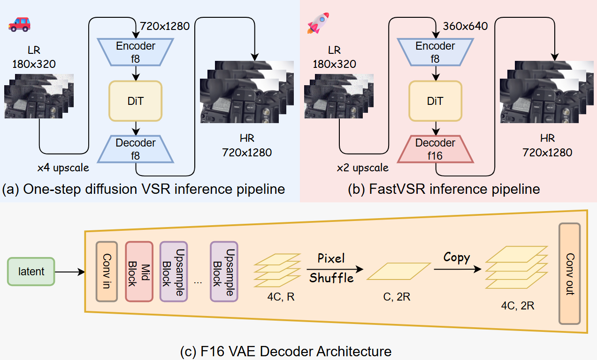
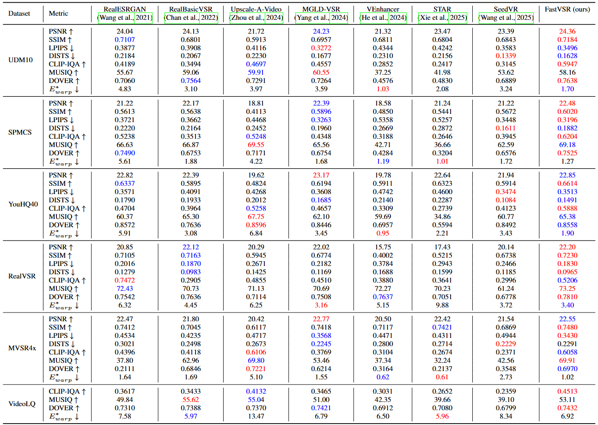
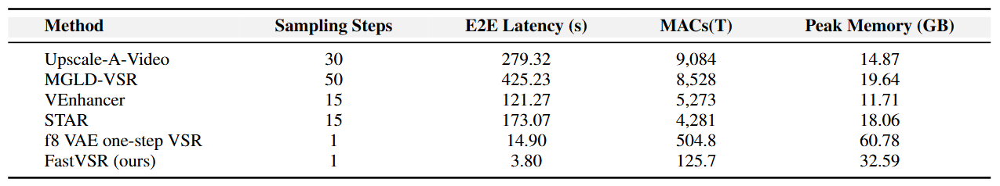
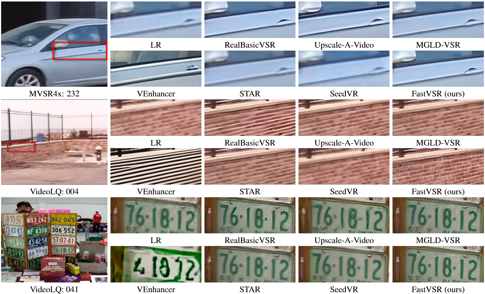

# Asymmetric VAE for One-Step Video Super-Resolution Acceleration

Jianze Li, [Yong Guo](https://www.guoyongcs.com/), [Yulun Zhang*](http://yulunzhang.com/), and [Xiaokang Yang](https://scholar.google.com/citations?user=yDEavdMAAAAJ) "Asymmetric VAE for One-Step Video Super-Resolution Acceleration", arXiv, 2025

[project] [[arXiv]] [supplementary material] [pretrained models]


#### 🔥🔥🔥 News

- **2025-10-01:** This repo is released.

---

> **Abstract:** Diffusion models have significant advantages in the field of real-world video super-resolution and have demonstrated strong performance in past research. In recent diffusion-based video super-resolution (VSR) models, the number of sampling steps has been reduced to just one, yet there remains significant room for further optimization in inference efficiency. In this paper, we propose FastVSR, which achieves substantial reductions in computational cost by implementing a high compression VAE (spatial compression ratio of 16, denoted as f16). We design the structure of the f16 VAE and introduce a stable training framework. We employ pixel shuffle and channel replication to achieve additional upsampling. Furthermore, we propose a lower-bound-guided training strategy, which introduces a simpler training objective as a lower bound for the VAE's performance. It makes the training process more stable and easier to converge. Experimental results show that FastVSR achieves speedups of 111.9 times compared to multi-step models and 3.92 times compared to existing one-step models.




---

## 🔖 TODO

- [ ] Release testing code and pre-trained models.
- [ ] Release training code. 
- [ ] Release pre-trained models.
- [ ] Provide HuggingFace demo.

## 🔗 Contents

1. Models
1. Training
1. Testing
1. [Results](#results)
1. [Citation](#citation)
1. [Acknowledgements](#acknowledgements)

## <a name="results"></a>🔎 Results

<details>
<summary>Quantitative Results (click to expand)</summary>

- Results in Table 1 of the main paper

<p align="center">
  
</p>

- Efficiency comparsion in Table 2 of the main paper

<p align="center">
  
</p>

</details>

<details>
<summary>Qualitative Results (click to expand)</summary>

- Results in Figure 4 of the main paper

<p align="center">
  
</p>


</details>

## <a name="citation"></a>📎 Citation

If you find the code helpful in your research or work, please cite the following paper(s).

```

```
